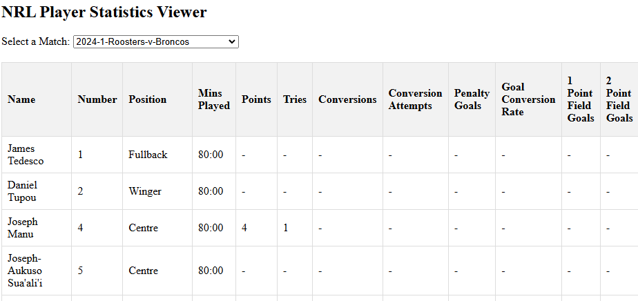

# Scrapers

## Overview
This script fetches and saves NRL player statistics per round for a selected year. It is optimized for fast execution using a persistent Selenium WebDriver.

## Usage

### Running the Data Downloader
Execute the following command from the `scraping` directory:
```bash
python downloader.py
```
> You must specific the selection and years

### Running the Web Scraper
Execute the following command from the `scraping` directory:
```bash
python run.py
```
> You must specific the selection and years

### HTML Web Viewer
Open the HTML file in html_interfaces to use the interactive website viewer. It looks like the following:


### Script Functionality
1. **Loads Match Data**
   - Reads `nrl_data_YEAR.json` containing match details.
   - Extracts match information (teams, round, and year).

2. **Scrapes Player Statistics**
   - Uses Selenium WebDriver to navigate to match pages.
   - Extracts player statistics using BeautifulSoup.
   - Stores match and player data in JSON format.

3. **Saves Data**
   - Writes to `player_statistics_YEAR.json` after each round.
   - Ensures data is saved incrementally to prevent loss.

## Output Files
- `data/{selected type}/{selected year}/{selected type}_data_YEAR.json`: Raw match data.
- `data/{selected type}/{selected year}/{selected type}_player_statistics_YEAR.json`: Player statistics structured as:
  ```json
  {
      "PlayerStats": [
          {
              "YEAR": [
                  {
                      "Round": [
                          { "Match": [{"Player Name": "Stats"}] }
                      ]
                  }
              ]
          }
      ]
  }
  ```


## Notes
- Ensure `chromedriver` is properly configured.
- Modify `selected_year` and `selected_rounds` in script to adjust the range.
- The script may require updates if the NRL website structure changes.

For any issues, refer to console logs for debugging.


